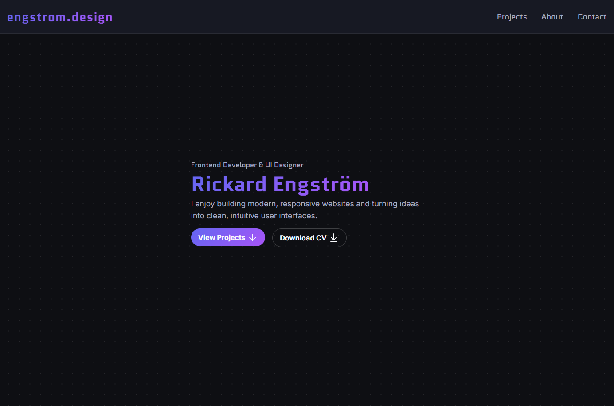

# Portfolio Website

This is my personal portfolio website built with React and Vite.
The project focuses on a modern, clean and user-friendly design.

Live: https://engstrom.design

## Purpose

The goal of this project is to have a single place to present my projects and web development skills.

## Tech

- React
- TypeScript
- Vite
- CSS (custom, no frameworks)
- Iconify & Lucide icons

## Features

- Responsive layout
- Project showcase with live demos and GitHub links
- Minimal and accessible navigation
- Custom styling
- Subtle effects/animations

## Notes

- The project is intentionally kept simple for accessibility (not a fan of overdesigned portfolios).
- Design and layout are continuously refined over time.
- Some parts may change as new projects are added.

## Future Improvements

- Add more impressive projects.
- Continuous improvement of accessibility and UX.
